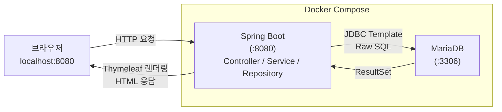

# 협찬 통합 관리 시스템 — 프로젝트 설계 계획

**날짜**: 2026-05-07

## 배경

대학 학생회·동아리의 기업 협찬 요청 과정이 카카오톡·메일·DM·엑셀에 흩어져 있어
이력 관리·흐름 추적·성과 분석이 불가능하다. 데이터베이스 수업 팀 프로젝트로,
학생단체·인플루언서·기업 세 주체가 협찬 요청부터 후기까지 한 시스템에서 처리할 수 있는
DB 기반 웹 애플리케이션을 설계·구현한다.

- 기간: 약 4주
- 팀원: 3학년 4명
- 평가 배점: 프로젝트 관리 25점 / 기술 50점 / 결과물 품질 25점 / 가산점

## AS-IS

- 협찬 관련 커뮤니케이션이 카카오톡·메일·DM에 분산
- 기업별 협찬 이력 없음 → 매년 처음부터 재시작
- 인플루언서 협찬 실적 데이터화 불가
- 후기·평점이 외부 폼에 분산 수집 → 성과 분석 불가

## TO-BE

- 협찬 요청 등록 → 기업 제안 → 승인 → 발송 → 완료 → 후기까지 단일 시스템에서 처리
- 모든 협찬 이력이 DB에 누적 → 통계·추천 기능으로 활용
- 사용자 유형별 권한 분리 (MariaDB GRANT/REVOKE)
- SQL 집계·윈도우 함수·서브쿼리로 통계 리포트 자동 생성

---

## 기술 스택

| 구분 | 선택 | 이유 |
|------|------|------|
| DB | MariaDB | 수업 실습 환경과 동일, 팀 전원 경험 있음 |
| 백엔드 | Spring Boot 3 | 레이어 분리로 4명 역할 분담 용이 |
| DB 접근 | JDBC Template | Raw SQL 직접 작성 → 수업 목표 SQL 능력 직접 발휘 |
| 프론트엔드 | Thymeleaf (서버사이드) | JS 없이 HTML만으로 화면 구성 가능, 팀원 JS 미숙 → Spring과 자연스럽게 연결 |
| DB 클라이언트 | DBeaver / HeidiSQL | 팀원별 선호 툴 사용 가능 (같은 MariaDB에 접속) |
| 환경 통일 | Docker Compose | MariaDB + Spring Boot 한 명령으로 실행 (가산점: 배포 시연) |
| 협업 | Git + GitHub | 브랜치 전략으로 팀원별 기여도 커밋 로그에 반영 |

### 버전 고정

| 항목 | 버전 | 비고 |
|------|------|------|
| Java | 17 | Spring Boot 3 최소 요구사항, LTS |
| Spring Boot | 3.3.x | 현재 안정 버전 |
| Build Tool | Maven | 학교 프로젝트 표준, Spring Initializr에서 선택 |
| MariaDB | 10.6 | 윈도우 함수(RANK·LAG) 지원 확인된 버전 |
| Docker Compose | 최신 (v2) | `docker compose` 명령어 사용 (`docker-compose` 아님) |

> 팀원 전원 `java -version` 확인 후 17 미만이면 설치 먼저 진행할 것

### 시스템 구조



- 브라우저 → Spring Boot(8080): HTTP 요청
- Spring Boot → MariaDB(3306): JDBC Template으로 SQL 직접 실행
- 두 컨테이너는 Docker Compose 내부 네트워크로 연결
- 팀원 로컬에서 `docker compose up` 한 번으로 전체 실행

---

## 핵심 기능 목록

### 기능 1 — 사용자 관리
- 회원가입·로그인 (사용자 유형: 학생단체 / 인플루언서 / 기업)
- 유형별 접근 권한 분리: MariaDB `GRANT/REVOKE`
- 제약조건: `CHECK`, `UNIQUE`, `NOT NULL` 적극 활용

### 기능 2 — 협찬 요청 등록·검색
- 등록 항목: 행사명, 일정, 카테고리, 필요 물품, 예상 노출 수
- 기업 검색: 카테고리 / 예산 범위 / 날짜 필터 + 정렬
- 인플루언서도 동일 흐름으로 요청 가능

### 기능 3 — 매칭·승인 워크플로우
- 상태 흐름:
  ```
  PENDING → OFFERED → APPROVED → SHIPPED → DONE → REVIEWED
  ```
- 상태 변경 시 `sponsorship_history` 테이블에 이력 INSERT (트랜잭션 처리)
- 잘못된 순서의 상태 변경 시 예외 처리·롤백

### 기능 4 — 후기·평점
- 행사 완료 후 양측 상호 평가 (1~5점)
- 중복 후기 방지: `UNIQUE(sponsorship_id, reviewer_id)`

### 기능 5 — 통계·리포트 (SQL 활용2 핵심)

| 리포트 | SQL 기법 | 출력 형태 |
|--------|---------|---------|
| 기업별 협찬 횟수·평균 평점 TOP 10 | `GROUP BY` + `AVG` + `RANK()` | 테이블 |
| 월별 협찬 건수 추이 | `DATE_FORMAT` + `GROUP BY` | `*` 막대그래프 |
| 전월 대비 협찬 증감률 | `LAG()` 윈도우 함수 | 퍼센트 |
| 함께 협업한 기업 추천 | 서브쿼리 + `JOIN` | 추천 목록 |
| 신뢰도 높은 인플루언서 추천 | 평점×0.6 + 활동빈도×0.4 가중치 | TOP 5 |
| 카테고리별 협찬 성사율 | `CASE WHEN` + `GROUP BY` | 비율 |

---

## 역할 분담

### 공통 (전원 — 1주차 목~토)
엔티티 설계와 관계 정의가 평가 핵심이므로 ERD·모델링은 전원이 함께 진행한다.

| 단계 | 작업 | 산출물 |
|------|------|--------|
| 개념적 모델링 | 엔티티 식별, 관계 정의 | ER 다이어그램 초안 |
| 논리적 모델링 | 정규화(3NF), 속성·키 확정 | 테이블 명세서 |
| ERD 확정 | 전원 리뷰 후 최종 확정 | ERD (DBeaver 또는 draw.io) |

### 개인 역할 (2주차~)

| 팀원 | 담당 | 주요 작업 | 평가 연결 |
|------|------|---------|---------|
| A (팀장) | 물리적 모델링·환경 | schema.sql (인덱스·제약조건), GRANT/REVOKE, seed.sql, Docker 설정 | 데이터 모델링, 물리적 설계 |
| B | 사용자·요청 | UserController/Repository, 협찬 요청 CRUD, 검색·필터 | SQL 활용1 (CRUD, JOIN) |
| C | 워크플로우·후기 | MatchingController, 상태 전이 트랜잭션, 후기·평점 | SQL 활용1 (트랜잭션), 안정성 |
| D | 통계·리포트 | `queries/stats/` 쿼리 6개, ASCII 바차트, StatsController | SQL 활용2 전체 |

> **Service 레이어 컨벤션 합의 필요** (첫 회의 안건): 비즈니스 로직은 Service에, DB 접근만 Repository에 둔다. 팀 전원 동의 후 진행.

### Git 브랜치 전략
```
main
└── develop
    ├── feature/erd-modeling     (전원, 1주차 목~토)
    ├── feature/db-setup         (A: schema, seed, roles, docker)
    ├── feature/user-request     (B)
    ├── feature/matching-review  (C)
    └── feature/stats-report     (D)
```
- 기능 완성 후 PR → develop 머지
- 커밋 메시지 형식: `[기능] 작업 내용` (예: `[stats] 월별 협찬 추이 쿼리 추가`)

---

## 프로젝트 구조 (예정)

```
sponsorship-db/
├── pom.xml                         # Spring Boot 의존성 관리 (Spring Initializr 생성)
├── docker-compose.yml              # mariadb:10.6 + Spring Boot (버전 고정)
├── queries/                        # DBeaver에서 직접 실행 가능한 독립 SQL 파일
│   ├── README.md                   # 실행 순서 안내 (00 → stats 순)
│   ├── 00_schema.sql               # DDL: 테이블·제약조건·인덱스
│   ├── 00_seed.sql                 # 샘플 데이터 (기업 10개·협찬 50건 이상)
│   ├── 00_roles.sql                # GRANT/REVOKE DCL
│   └── stats/
│       ├── 01_top10_companies.sql         # GROUP BY + RANK() + AVG
│       ├── 02_monthly_trend_ascii.sql     # DATE_FORMAT + REPEAT('*', n) 바차트
│       ├── 03_mom_growth_rate.sql         # LAG() 윈도우 함수
│       ├── 04_low_response_detection.sql  # CASE WHEN + GROUP BY
│       ├── 05_company_recommendation.sql  # 서브쿼리 + JOIN
│       └── 06_category_success_rate.sql   # GROUP BY + AVG + CASE WHEN
├── src/
│   ├── main/
│   │   ├── java/com/sponsorship/
│   │   │   ├── SponsorshipApplication.java   # 앱 진입점 (main 메서드)
│   │   │   ├── model/                        # 각 테이블에 대응하는 POJO + RowMapper용
│   │   │   │   ├── User.java
│   │   │   │   ├── Company.java
│   │   │   │   ├── Sponsorship.java
│   │   │   │   ├── SponsorshipHistory.java
│   │   │   │   └── Review.java
│   │   │   ├── controller/
│   │   │   │   ├── UserController.java
│   │   │   │   ├── SponsorshipRequestController.java
│   │   │   │   ├── MatchingController.java
│   │   │   │   └── StatsController.java
│   │   │   ├── service/
│   │   │   │   ├── UserService.java
│   │   │   │   ├── SponsorshipService.java
│   │   │   │   ├── MatchingService.java
│   │   │   │   └── StatsService.java
│   │   │   └── repository/
│   │   │       ├── UserRepository.java
│   │   │       ├── SponsorshipRepository.java
│   │   │       ├── MatchingRepository.java
│   │   │       └── StatsRepository.java
│   │   └── resources/
│   │       ├── application.yml     # MariaDB 접속 정보·포트 설정
│   │       ├── templates/          # Thymeleaf HTML 파일
│   │       └── static/             # CSS·이미지 등 정적 파일
│   └── test/                       # 테스트 코드
├── docs/
│   ├── plan/                       # 이 파일
│   └── meetings/                   # 주별 회의록
└── README.md
```

---

## 4주 타임라인

### 1주차: 학습 스프린트 + 설계 확정 + 환경 세팅
- **월~수 (학습 스프린트)**: 팀원 전원 Spring Boot 튜토리얼 따라하기
  - Spring Initializr로 프로젝트 생성 → JDBC Template으로 간단한 CRUD 1개 완성
  - 목표: IoC·Bean·MVC 개념 체감, Thymeleaf 렌더링 흐름 파악
  - 이 단계는 프로덕션 코드를 작성하지 않고 학습에만 투자
- **목~일**: ERD 확정 (전원 참여, A 주도), schema.sql 작성, Docker 환경 구성
- GitHub 레포 생성, 브랜치 전략 합의
- **확인 포인트**: `docker-compose up` 으로 MariaDB 연결 확인 + 튜토리얼 CRUD 화면 동작 확인

### 2주차: 기본 기능 구현
- B: 회원가입·로그인, 협찬 요청 CRUD
- C: 협찬 매칭 상태 변경, 트랜잭션 처리
- D: 샘플 데이터 삽입, 통계 쿼리 초안 작성
- **확인 포인트**: 기본 화면(Thymeleaf)에서 CRUD 3개 이상 동작 확인

### 3주차: 고급 기능 완성
- C: 후기·평점 CRUD + 예외처리
- D: 통계 리포트 전체 완성 (윈도우 함수·서브쿼리 포함)
- 전원: 화면(Thymeleaf) 연결
- **확인 포인트**: 협찬 요청 → 승인 → 후기 전체 흐름 시연 가능

### 4주차: 마무리 + 발표 준비
- 예외처리·입력 검증 보강
- 문서화: README, 사용 매뉴얼, 발표 자료
- 개인별 기술 블로그 작성
- 최종 발표 리허설
- **확인 포인트**: `docker-compose up` 한 번으로 전체 시연 가능

---

## 가산점 전략

| 항목 | 대응 방법 |
|------|---------|
| 배포 파일 시연 | `docker-compose.yml` 으로 MariaDB + Spring Boot 패키징 |
| 개인별 기술 블로그 | 각자 velog에 담당 기능 정리 (ERD 설계 과정, 쿼리 최적화 등) |
| Git 기여도 명시 | 기능별 브랜치 → PR 머지 → 커밋 로그에 팀원별 기여도 자동 반영 |
| 회의록 문서화 | `docs/meetings/` 폴더에 주별 회의록 커밋 |

---

## 고려사항

- JPA 사용 금지: 수업 평가가 SQL 직접 작성 능력을 보기 때문에 JDBC Template 고수
- **model/ 패키지 필수**: JDBC Template은 쿼리 결과를 담을 POJO(RowMapper용)가 필요. `Sponsorship.java`, `Company.java` 등을 `model/` 패키지에 통일해 Repository마다 매핑 방식이 달라지는 혼란을 방지
- **로그인 구현 방식**: Spring Security를 쓰지 않고 `HttpSession`으로 직접 세션 관리. 사용자 유형별 접근 제어(예: 기업 계정은 협찬 요청 등록 불가)는 인터셉터 또는 컨트롤러에서 세션 체크로 직접 구현 — B 담당자 공수 고려 필요
- **Spring 학습 리스크**: 팀원 전원 Spring 경험 없음. 1주차 학습 스프린트(월~수)를 건너뛰면 환경 세팅 삽질로 1주차 전체를 소진할 수 있음 → 튜토리얼 선투자를 반드시 지킬 것
- 인덱스 설계: `company_id`, `status`, `category`, `created_at` 컬럼 위주로 적용 → 물리적 모델링 점수
- 트랜잭션 격리 수준: 상태 변경 시 `READ COMMITTED` 명시적 설정으로 동시성 이슈 방지
- 샘플 데이터: 통계 쿼리가 의미 있게 나오려면 최소 기업 10개·협찬 50건 이상 필요
- MariaDB 윈도우 함수: `RANK()`, `LAG()` 등 MariaDB 10.2 이상에서 지원 — 버전 확인 필요
